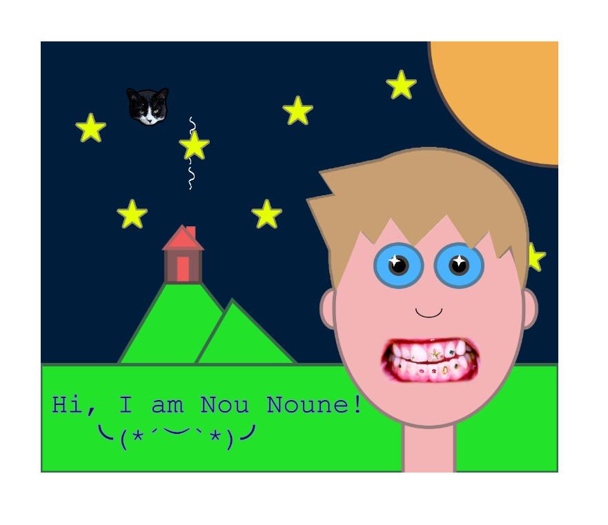

## Nou Noune's Art Jam

By Amélie Barrette (Nou Noune).

[View this project online](https://nounoune666.github.io/cart253/topics/Portrait_Assignment/)

## Description

> *"Nou Noune's Art Jam" is a portrait assignment for Pippin Barr’s CART 253 class. It’s meant to give the user an idea of who I am — Amélie Barrette, aka Nou Noune.

> The experience is designed to be observed, with a touch of interactivity. Move the mouse around and see who’s following you (hint: her name starts with a B). Hold the mouse down on the mouth and you’ll hear the most wonderful cover sung in Simlish (the language of The Sims). If you release the mouse, you'll hear nothing except for what is actually around you. Wow, immersive!

> You’ll also discover some of my favorite things: my grandma’s cottage, starry nights, gems, nature, sims-related stuff and the big, beautiful, ever-changing sun.

## New p5 functions used.

> Alls the images: (https://p5js.org/reference/p5/p5.Image/).

> The arc for the nose: (https://p5js.org/reference/p5/arc/).

> The audio (play and stop): (https://developer.mozilla.org/en-US/docs/Web/API/HTMLAudioElement/Audio).

> The text: (https://p5js.org/reference/p5/text/).

## Screenshot(s)

Here's what the program looks like when it's running:

> 

## Attribution

This bit should attribute any code, assets or other elements used taken from other sources. For example:

> - This project uses [p5.js](https://p5js.org).
> - The photo of the cat (Brigitte), is taken by my lovely girlfriend, Laurence Wells.
> - The Katy Perry cover in Simlish is taken from youtube (https://www.youtube.com/watch?v=sxyW6AJ-yIk).
> - The hair and hair border picture is a Wii Mii Maker design found online here: (https://www.reddit.com/r/malehairadvice/comments/171nhly/what_is_this_haircut_called_i_really_wanna_get_it/). The color was modified using photoshop.
> - The photo of the teeth is mine and those are my teeth.
> - The eyestar, star, smoke and smoke2 pictures where made by me in photoshop.
> - The project template is Pippin Barr's p5 template! Thanks Pippin !

## License

> This project is licensed under a Creative Commons Attribution ([CC BY 4.0](https://creativecommons.org/licenses/by/4.0/deed.en)) license with the exception of libraries and other components with their own licenses.