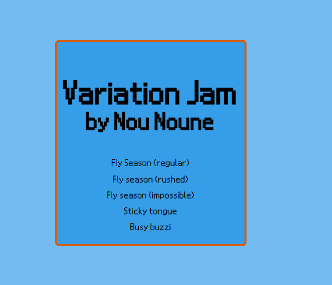
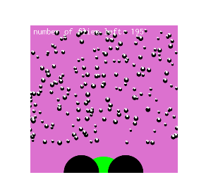
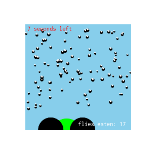
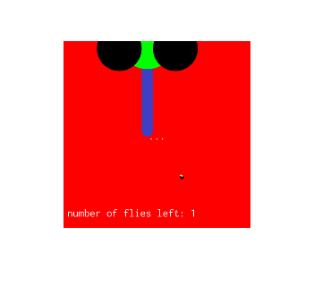
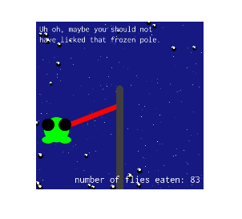
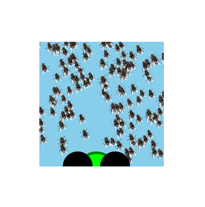

# Variation Jammy

by Amélie Barrette

[View this project online](https://nounoune666.github.io/cart253/topics/variationJam/variationJamMenu/)

## Description

Variation Jammy is a collection of five games all based on Pippin Barr's frogfrogfrog. They are meant to be quick, simple, and fun!

### Variation one: Fly Season (regular)
- Controls: use space bar to launch tongue and catch flies. Use the mouse to control the frog.
- Instructions: Catch all 200 flies. 
- Notable code features: arrays for the flies, map() and lerpcolor() for color changes (frog and background), tongue controlled by space bar.
[Here's the link for Fly season (regular)](https://nounoune666.github.io/cart253/topics/variationJam/variationJamOne/)

### Variation two: Fly Season (rushed). 
- Controls: use up arrow to launch tongue and catch flies. Use the mouse to control the frog.
- Instructions: Catch as many flies as you can in 10 seconds.
- Notable code features: arrays for the flies, countdown function based on seconds (and frame count), score function, conditionals logic in draw() so functions stop running at specific times, tongue controlled by arrow key.
[Here's the link for Fly season (rushed)](https://nounoune666.github.io/cart253/topics/variationJam/variationJamTwo/)

### Variation three: Fly Season (impossible). 
- Controls: press to launch tongue and catch flies.
- Instructions: Catch all 200 flies, if you can manage it...
- Notable code features: arrays for the flies, JSON file.
[Here's the link for Fly season (impossible)](https://nounoune666.github.io/cart253/topics/variationJam/variationJamThree/)

### Variation four: Sticky Tongue. 
- Controls: Use the mouse to swing around and catch the flies.
- Instructions: Catch as many flies as you can and want. There is no time limit for this one. Enjoy the snowy night while your tongue is stuck to the pole.
- Notable code features: arrays for the flies, score feature, falling snow, bouncing flies (array and conditionals), changed  
[Here's the link for Sticky Tongue](https://nounoune666.github.io/cart253/topics/variationJam/variationJamFour/)

### Variation five: Busy Buzzi. 
- Controls: use space bar to launch tongue and catch the flies. 
- Instructions: Try and catch as many flies as possible, but be careful, they might get angry though.
- Notable code features: arrays for the flies, image as a fly, return of the gameIsGaming function, growing size and buzziness through fly array.
[Here's the link for Busy Buzzi](https://nounoune666.github.io/cart253/topics/variationJam/variationJamFive/)

## Attribution

Base game by Pippin Barr [Find the template here](https://pippinbarr.com/cart253/assignments/art-jam/)

Fly image from PNG EGG [link here](https://www.pngegg.com/en/search?q=fly+Insect)

## License

This project is licensed under a Creative Commons Attribution ([CC BY 4.0](https://creativecommons.org/licenses/by/4.0/deed.en)) license with the exception of libraries and other components with their own licenses.

